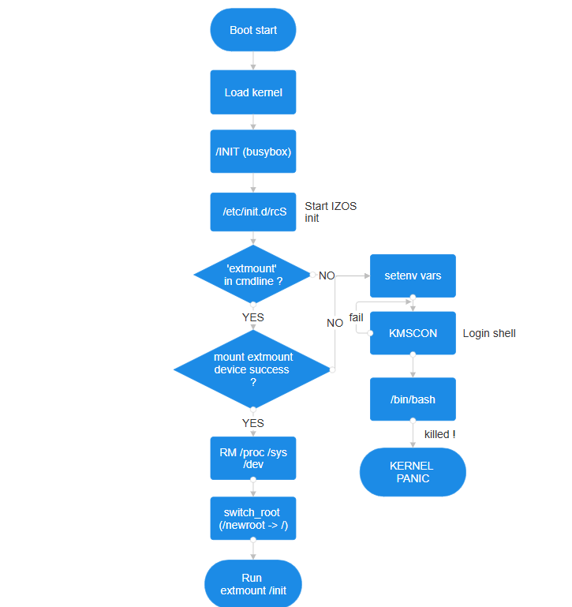

<h1 align="center">IZOS: Linux Edition</h1>

<p align="center">
  Lightweight • Modular • Built From Scratch
</p>

<p align="center">
  
  
  
  
  
  
  
</p>
This is IZOS — the real one, not the Python simulator.
IZOS is a Linux distribution built from scratch. It is not based on an existing distro; the entire system, including the Linux kernel, userspace, init system, and tools, is compiled specifically for IZOS.  

## Features

- Custom init system
- Initramfs-based edition
- Modular extmount system
- BusyBox userspace
- Custom sudo implementation
- Python 3 support
- Built entirely from source
  
## Contents

- [What's IZOS](#whats-izos)
- [Why IZOS?](#why-izos)
- [Modularity](#the-modularity-of-izos)
- [File Structure](#file-structure)
- [Included Software](#whats-included)
- [Running IZOS](#how-do-i-run-this)
- [Networking](#networking)
- [(Re)Building IZOS](#building-izos)
- [Boot Flow](#boot-flow)
- [Roadmap](#roadmap)
- [Contributing](#contribute)

## What's IZOS
IZOS (pronounced _i zede ow ess_) is a linux distro I built myself, with the only help being the linux kernel docs.  
I made this because i was bored, but also because i wanted to create a real version of [IZOS-Python](http://github.com/FrenchPythonLover/IZOS), a complete OS simulator with a package manager, init and more...  
What makes IZOS unique is its modular design.

## The modularity of IZOS
IZOS is unique: you can run it off RAM (initramfs edition), but also run a different environment on the same USB, using the homemade `extmount` system.  
Here's what's planned:  
On the initramfs edition, there will only be small utilities and minigames to keep the system small.  
On the extmount edition, there will be a GUI (X.org), more apps...  

## Why IZOS?
IZOS started as a Python project. It was one of my first attempts at writing a larger multi-file codebase when I was 9 years old. It's still available and will be maintained [here](http://github.com/FrenchPythonLover/IZOS),  
but as stated above i started getting bored and wanted a little more challenge, so i thought that making a version that can really be executed on a real hardware without any dependencies would be fun, so here I am !  

## File structure
Here's the project structure:
```
root/
├─ apps/ -- initramfs apps source & compiled
├─ apps_ext/ -- extmount apps source & compiled
├─ fs/ -- initramfs filesystem uncompressed
├─ fs_ext/ -- extmount filesystem unimged
├─ linux/ -- Linux kernel source & images
│  ├─ src/ -- Kernel source
|  ├─ compile.sh -- IZOS full compilation script (omitting apps)
|  ├─ bzImage -- IZOS kernel image
|  ├─ initramfs.cpio.gz -- initramfs edition file
├─ createextfs.sh -- extmount fs creation tool 
├─ makeinitramfs.sh -- initramfs gz creation tool
├─ test -- Run initramfs IZOS on qemu
├─ test_ext -- Run extmount IZOS on qemu
├─ (eventually) fs_ext.img -- The extmount filesystem in its IMGed form
```

## What's included
IZOS comes with a bit of programs:  
  - python3
  - asciipat
  - htop
  - neofetch
  - nyancat
  - cmatrix
  - busybox & all of its tools
  - nano
  - yazi
  - sudo (home-made)
  - wpa_supplicant (WiFi W.I.P, see [Network on IZOS](#networking))
every one of the above has been tested and runs great on my OS.  

## How do I run this?
First, you need to modify the system root to your preferred language: Open ./fs/etc/init.d/rcS, scroll all the way to the bottom and follow the instructions.  
Let's boot IZOS ! For the moment, you can only run this using QEMU, on Linux.  
First of all, install `qemu-system-x86_64` on your distro.  
Then, to launch ramdisk IZOS, run `./test`, a new window will appear: it's the TTY, on the terminal that launched the command however, its the serial output where you can debug IZOS.  
Here are the credentials:  
| Username | Password | Usage |
|----------|----------|--------|
| root | none | Root user |
| izos | none | Normal user |

If you want to launch the ext izos, generate the ext file using `./createextfs.sh`, then run `./test_ext`

## Networking
Actually, networking on IZOS might be supported on ethernet but hasn't been tested on ethernet-equipped real hardware.  
WiFi is actually in development.  

## Building IZOS
To build IZOS, just run those commands:  
```bash
# CD to building directory
cd ./linux
# Clean everything (Recommended)
./clean.sh
# Run build script
./compile.sh
```
## Boot flow


## Roadmap
- [x] Custom init system
- [x] BusyBox integration
- [x] Initramfs edition
- [x] Extmount support
- [ ] Networking
- [ ] Package manager
- [ ] GUI
- [ ] Installer for real hardware

# Contribute
Feel free to contribute by submitting pull requests !


### Stats


<hr>
Made with ❤️ by FrenchPythonLover

